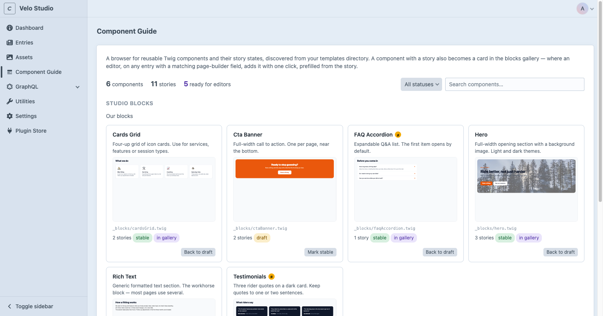
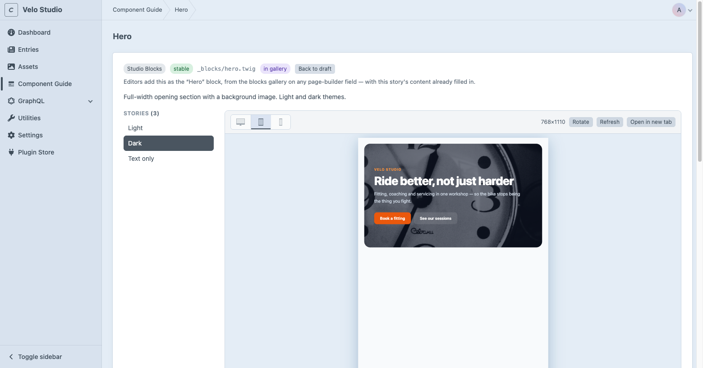
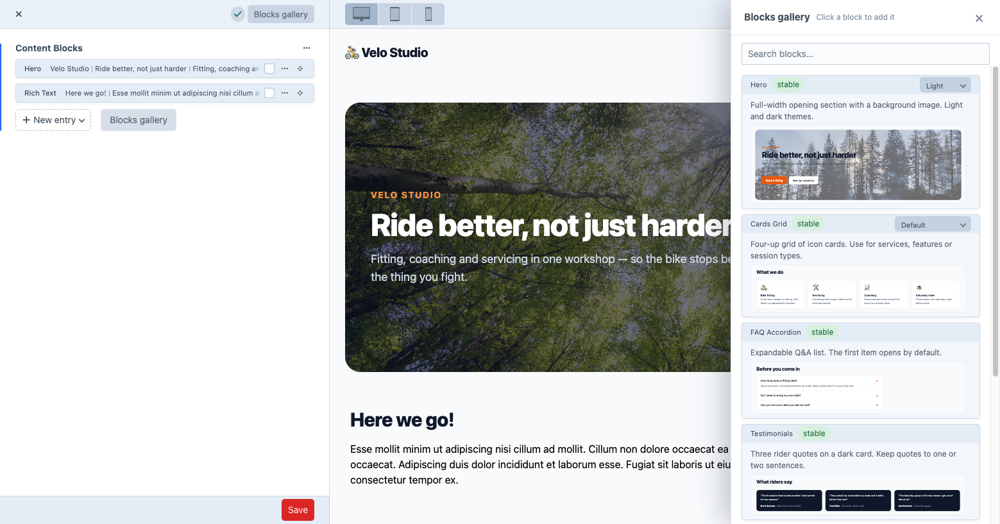
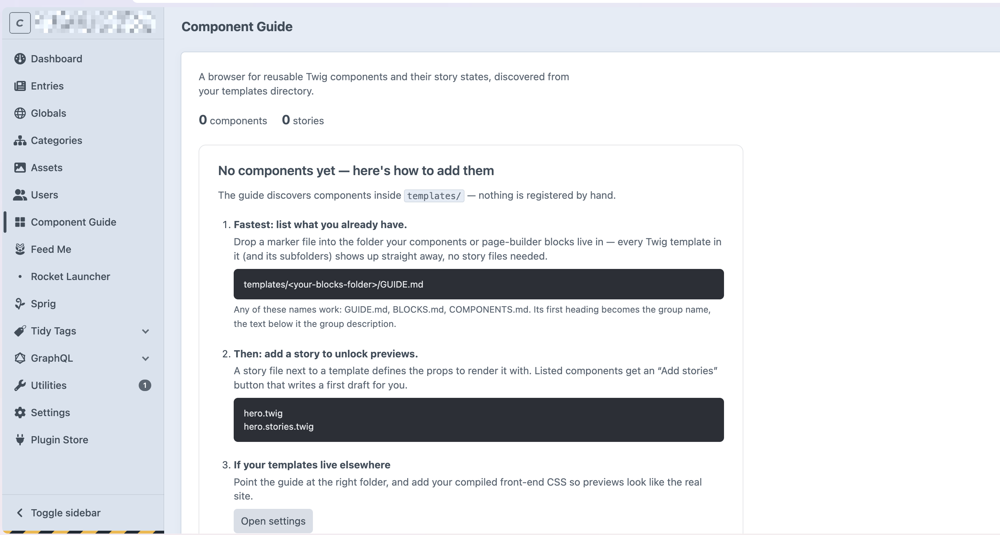

# Component Guide

[](https://github.com/b10k-nl/craft-component-guide/actions/workflows/ci.yml)

A Storybook-style component browser inside the Craft CMS 5 control panel — live previews for developers, a visual blocks gallery for editors.

Component Guide scans a configurable templates directory, discovers Twig components and their story definitions, and renders isolated previews inside the Craft control panel — so content editors and developers can see what each component looks like and how to use it, without setting up a separate Storybook/Twig environment.







Nothing configured yet? The guide starts by explaining how to get there:



> **Status:** `0.1.0-beta` — public beta. The discovery/preview workflow is stable; APIs may still change before `1.0`. See [BETA.md](BETA.md).

---

## Requirements

- Craft CMS **5.0+**
- PHP **8.2+**

## What it does

- Recursively discovers components from a configured templates folder.
- Supports nested (`button/button.twig` + `button/button.stories.twig`) and
  adjacent (`button.twig` + `button.stories.twig`) conventions.
- Two story languages (Twig and PHP) and two shapes (simple + rich),
  normalized to one internal model.
- Groups, lists and client-side-searches components in the CP.
- Renders each story in a sandboxed **iframe** with your front-end CSS.
- Generates a copy-pasteable Twig `` snippet.
- Surfaces per-component errors without breaking the rest of the guide.
- Lists story-less templates via **marker files** (`GUIDE.md` / `BLOCKS.md` /
  `COMPONENTS.md`), so the guide doubles as a full component inventory.
- **Blocks gallery for editors:** a "Blocks gallery" button on every Matrix
  page-builder field (all view modes — blocks, cards, index) opens a panel of
  real component previews with descriptions; clicking one adds that block. In
  "Inline-editable blocks" mode the new block is prefilled with the story's
  own content, so it is visible on the page immediately.
- Persistent scan cache keyed by a filesystem fingerprint — invalidates itself
  the moment a story, template or marker changes.

## Installation

During the beta the plugin installs straight from GitHub (it is not on
Packagist or the Plugin Store yet):

```bash
composer config repositories.component-guide vcs https://github.com/b10k-nl/craft-component-guide.git
composer require "b10k/craft-component-guide:^0.1.0-beta"
php craft plugin/install component-guide
```

On DDEV, prefix each command with `ddev`. See [BETA.md](BETA.md) for a
“first five minutes” walkthrough and what feedback helps most.

## Configuration

Settings can be edited in **Settings → Plugins → Component Guide**, or overridden
per-environment with a config file. The config file **wins**; any field it sets
is read-only in the CP.

`config/component-guide.php`:

```php
<?php

return [
    'componentPath' => '',                 // scan root, relative to templates/ ('' = whole dir)
    'storySuffix' => '.stories.php',
    'enableCpSection' => true,
    'enableIframePreview' => true,
    'previewCss' => ['/dist/css/app.css'], // string or array
    'previewJs' => ['/dist/js/app.js'],
    'previewTemplate' => '',               // site template rendered into the preview <head>
];
```

| Setting | Default | Notes |
|---|---|---|
| `componentPath` | `''` (whole `templates/`) | Scan root relative to `templates/`. Empty scans everything; set e.g. `_components` to narrow. No absolute paths or `..`. |
| `storySuffix` | `.stories.php` | Must end in `.php`. The Twig equivalent (`.stories.twig`) is derived from it automatically and discovered too — that's the format the scaffolder writes. |
| `enableCpSection` | `true` | Show/hide the CP nav item. |
| `enableIframePreview` | `true` | Isolated iframe vs. an "open preview" link. |
| `previewCss` / `previewJs` | `[]` | Front-end assets injected into the preview. |
| `previewTemplate` | `''` | A site template rendered into the preview document's `<head>` — the right place for Vite/manifest asset tags (see below). |

**The model is Storybook-style:** the scanner walks the scan root recursively and
shows *every* Twig template that has an adjacent story file — anywhere in the
tree (components, page-builder blocks, partials). A template's author opts it into
the guide simply by dropping a `*.stories.twig` (or `*.stories.php`) next to it;
nothing else registers it. Components are grouped by their folder path (or by a
story's `meta.group`).

## Directory conventions

```
templates/_components/
├── button/
│   ├── button.twig
│   └── button.stories.twig
├── card.twig                 # adjacent convention also works
├── card.stories.twig
└── navigation/menu/
    ├── menu.twig
    └── menu.stories.twig
```

A Twig file is listed as a component only when it has a matching story file —
unless its folder is opted in via a **marker file** (see below).
Hidden files/dirs, `node_modules`, `vendor` and cache folders are ignored.

## Marker files: components without stories

Writing a story per component is an upgrade, not the ticket in. Drop a marker
file — `GUIDE.md`, `BLOCKS.md` or `COMPONENTS.md` — into any folder inside the
scan root, and **every** plain Twig template in that folder and its subfolders
is listed in the guide, story or not. Story-less templates appear as inert
“undocumented” cards with a hint to add a story; templates whose filename
starts with `_` are treated as internal partials and skipped.

The marker is also lightweight documentation:

```md
# Content Blocks

Reusable page blocks editors can add through the Matrix page builder.

## Anything below the intro is ignored by the guide — document freely.
```

- The **H1** becomes the group label. Group names mirror the folder hierarchy:
  a marker's H1 replaces its own folder's name in the chain and plain
  subfolders are humanized (`Components / Cards`). Components without an
  explicit `meta.group` inherit the derived name, so documented and
  undocumented cards share one section.
- The **intro text** below the H1 (up to the next heading) becomes the group
  description on the index page.
- One marker per folder; with duplicates, precedence is
  `GUIDE.md` → `BLOCKS.md` → `COMPONENTS.md` and the CLI scan warns.
- Not listed as components: files starting with `_` (internal partials) and
  `index.twig` / `undefined.twig` (the dispatcher pattern's entry point and
  fallback). A story file next to any of them still documents it explicitly.
- Markers live in git next to your templates and read as plain folder docs on
  GitHub. The scan cache tracks them automatically.

## Story format

Stories come in two languages — **Twig** (`*.stories.twig`) and **PHP**
(`*.stories.php`) — with the same shape. Twig is the default: it's the language
the component is already written in, and it's what the scaffolder writes. Both
are discovered automatically; pick per component if you like.

### Twig

```twig



```

`meta` is optional — a file with just `stories` works. The story file is
rendered as a data-only template: set those two variables and output nothing.

### PHP — simple

```php
<?php

return [
    'Primary'   => ['label' => 'Save', 'variant' => 'primary'],
    'Secondary' => ['label' => 'Cancel', 'variant' => 'secondary'],
];
```

### PHP — rich (with metadata)

```php
<?php

return [
    'meta' => [
        'title' => 'Button',
        'group' => 'Atoms',
        'description' => 'Primary user-action button.',
        'status' => 'stable',
    ],
    'stories' => [
        'Primary' => [
            'args' => ['label' => 'Save', 'variant' => 'primary'],
            'description' => 'The default call to action.',
            'background' => '#f5f5f5',
            'viewport' => 'phone',
            'tags' => ['action', 'form'],
        ],
    ],
];
```

Optional story keys: `args`, `description`, `background`, `viewport`, `tags`.

- **`viewport`** picks the device the preview opens in — `desktop` (default),
  `tablet` or `phone`. The reader can still switch; this just says which state
  the story is really about, so a mobile-only variant doesn't open in desktop.
- **`background`** sets the colour behind the preview frame (any CSS colour),
  useful for components meant to sit on a dark or tinted section.

**Status vocabulary:** `stable`, `beta`, `draft`, `deprecated` (case-insensitive;
`wip`, `ready`, `experimental` and `legacy` are accepted as aliases). Only
`stable` components are addable from the blocks gallery — see below.

### Component example

```twig
{# templates/_components/button/button.twig #}




<button type="button" class="button button--{{ variant }}" disabled>
    {{ label }}
</button>
```

Prefer plain arrays and scalar props. Craft element objects returned by trusted
story files are not blocked, but arrays keep stories portable.

## Scaffolding stories

Undocumented components (see marker files above) can bootstrap their own
story. Each undocumented card gets an **Add story** button in environments
where Craft's `allowAdminChanges` is on (local and staging by convention — the
same gate Craft uses for its own project-file changes); elsewhere the guide
says so instead of hiding the feature. The equivalent on the command line is:

```sh
php craft component-guide/components/make hero            # writes hero.stories.twig
php craft component-guide/components/make hero --states   # one story per detected state
php craft component-guide/components/make hero --format=php
```

The scaffolder reads the template and guesses a `Default` story from it:

- root variables become args; `` becomes a three-item
  sample array carrying the keys the loop actually uses (`it.title` → `title`);
- `|default('…')` and the `` idiom supply real values;
- everything else is guessed by name — `*Url` → `#`, image-ish `*Url` → an
  inline SVG placeholder, `*Html` → a paragraph, `is*`/`has*` → `true`;
- the first sentence of the template's leading `{# … #}` comment becomes the
  component description.

**One story, or one per state.** If the template switches on a value —
`theme == 'dark'`, `mediaPosition == 'right'` — those comparisons are its
states, and a second button appears next to **Add story**: **Add 2 stories**
(however many it found), with a tooltip naming the values. Taking it writes
one story per value (`Light`, `Dark`, `Media right`…) instead of a single
`Default`, so the component's variants are documented from the start. Either
way it is one story file — the buttons differ only in how many stories go
inside it.

The result is a **draft**: it is written with `status: draft`, the args are
guesses, and an existing story file is never overwritten. Review it, fix what
the heuristics got wrong, and promote the status when the component is
properly documented.

## Placeholder tokens

Stories don't have to carry their own copy. Any string arg can be a token,
expanded when the preview renders:

```twig

```

| Token | Result |
| --- | --- |
| `@lorem` | a short phrase |
| `@lorem_w_12` | 12 words |
| `@lorem_s_3` | 3 sentences |
| `@lorem_p_2` | 2 paragraphs, wrapped in `<p>` |
| `@image` | a photo, 800×600 |
| `@image_1600x600` | a photo at that size |
| `@icon` | one of Craft's system icons |
| `@icon_star` | that specific system icon |

Three things worth knowing:

- **Deterministic.** Values are derived from the component, story and argument
  path — the same story always renders the same text, so previews don't
  flicker and gallery thumbnails match the detail page. Items in a list still
  differ from each other, so three identical `@lorem_w_4` tokens produce three
  different samples.
- **Offline-safe.** Photos come from an external service; if it can't be
  reached, the preview falls back to an inline placeholder of the same size.
  Icons are always inline (no network).
- **Unknown tokens pass through.** `@something` the plugin doesn't recognise
  is left exactly as written.

The story scaffolder emits these tokens, which is why generated stories stay
short and readable.

### What to tokenise — and what not to

Tokens exist to kill busywork, not meaning. A useful rule:

- **Tokenise what carries no information:** photography, icons, “just some
  paragraph of text” in a fresh scaffold, the third and fourth items of a list.
- **Write real copy where the story asserts something:** the flagship state
  you'd screenshot, and the edge cases you're documenting on purpose — a
  heading long enough to wrap, a button label that nearly overflows, a card
  with no image.

A preview full of lorem tells you the component renders. A preview with real
copy tells you it *works* — that the two-line heading still fits, that the
tone is right, that “Membership” doesn't break the button. That's also what
makes the guide worth showing to a client or a new teammate.

So: scaffold with tokens (one click, previews come alive), then replace the
values that are worth a human's attention. That's exactly what the `draft`
status is there to remind you of.

## Recommended architecture: adapters + presentational components

The guide works with any template structure, but this three-layer pattern gets
the most out of it — and keeps a Matrix page builder maintainable:

```
templates/_v2/
├── _blocks.twig             # dispatcher — loops the Matrix field (~10 lines)
├── _adapters/               # entry-aware glue (NOT listed in the guide)
│   ├── hero.twig            #   one per block type, named after its handle
│   ├── promoBanner.twig
│   └── undefined.twig       #   fallback: dev/preview-only “unmapped block” alert
└── _blocks/                 # presentational components (listed in the guide)
    ├── BLOCKS.md            #   marker file — inventory + group description
    ├── hero.twig            #   pure: accepts scalars/arrays, never an Entry
    ├── hero.stories.twig    #   preview states for the guide
    └── promoBanner.twig
```

**Presentational components** accept plain scalars and arrays with `|default`
fallbacks — never a Craft element. That is exactly what makes them previewable
in the guide with simple array stories, and reusable outside the Matrix
context.

**Adapters** are the only layer that touches entries: one small template per
block type, receiving `{ block }`, doing all field access, `getFieldByHandle`
guards, image transforms, queries and fallbacks — then including the
presentational partial. They contain no markup of their own. Keep the folder
**outside** any marker-covered subtree so the guide never lists glue code as
components.

**The dispatcher** collapses to a loop with a convention-based include and an
automatic fallback (Twig picks the first template that exists):

```twig

    

```

`undefined.twig` renders a visible warning in dev mode / live preview and
nothing in production — a new block type shows up as an actionable alert
instead of silently rendering nothing.

Rules of thumb: a component never touches an Entry; an adapter never contains
markup; adding a block = entry type + adapter + component (+ story when it
earns one).

## Preview asset configuration

Set `previewCss` / `previewJs` (string or array of URLs) to load your compiled
front-end assets into the preview document. With none configured you get a clean,
unstyled document. CSS support matters most; JS is optional.

**Using Vite (or any manifest-based build)?** Static URLs go stale between dev
and production — point `previewTemplate` at a small site template instead, and
put your asset tags there. It is rendered into the preview document's `<head>`
in site mode, so helpers like `craft.vite` resolve the dev server vs. the
built manifest exactly like on the front end — previews get real styling *and*
working component JS (carousels included) in both environments:

```twig
{# templates/_component-guide-preview.twig #}
{{ craft.vite.script('src/js/app.ts') }}
```

```php
// config/component-guide.php
'previewTemplate' => '_component-guide-preview',
```

## Uninstalling

### 1. Remove the plugin

Either from the control panel — **Settings → Plugins → Component Guide → ⚙ →
Uninstall** — or from the command line:

```bash
php craft plugin/uninstall component-guide
composer remove b10k/craft-component-guide
composer config --unset repositories.component-guide
```

That removes the plugin, its settings, its permission and its scan cache.

### 2. Decide what to do with your story files

They are **left in place on purpose.** A `*.stories.twig` next to a template is
inert without the plugin — nothing includes it, nothing renders it, it costs
nothing. A `GUIDE.md` is just a markdown file that reads as folder
documentation on GitHub. Keeping them means reinstalling later picks up exactly
where you left off.

If you do want them gone, delete them yourself — they're your files, in your
repository, and you should see the diff before it lands:

**In your editor (PhpStorm, VS Code, …)**

1. Search the project for `*.stories.twig` and `*.stories.php`
   (PhpStorm: <kbd>⌘⇧O</kbd> → type `.stories.` · VS Code: <kbd>⌘P</kbd> → same).
2. Review the list — some of these may be files you wrote or heavily edited.
3. Select and delete.
4. Search for `GUIDE.md`, `BLOCKS.md` and `COMPONENTS.md` inside your templates
   folder and delete those too, if you don't want them as folder docs.
5. Commit, so the removal is reviewable and revertable like any other change.

**In a terminal**

```bash
# preview first — nothing is deleted by this
find templates -name '*.stories.twig' -o -name '*.stories.php'

# then remove them through git, so the change is staged and revertable
git rm 'templates/**/*.stories.twig' 'templates/**/*.stories.php'
```

Marker files, if you want those gone too:

```bash
git rm 'templates/**/GUIDE.md' 'templates/**/BLOCKS.md' 'templates/**/COMPONENTS.md'
```

### What was never touched

Your content, your Matrix fields, your entry types, your templates. The guide
only ever *reads* them. The single exception is the **Add story** button (and
its CLI equivalent), which writes a story file you explicitly asked for — and
never overwrites an existing one.

The scan cache can also be cleared on its own at any time, without uninstalling
anything: **Utilities → Caches → Component Guide scan cache**.

## Security & trust model

- Story files are **project code** — Twig templates or PHP files in your repo.
  Treat them like any other template. They are only ever discovered inside the
  configured `componentPath`.
- The scanner refuses absolute paths and `..` traversal; the resolved directory
  must live inside your templates folder.
- Previews render only component/story **IDs** resolved through the repository —
  a request can never supply a raw template path.
- Every CP/preview action requires login and the `component-guide:access`
  permission.
- Previews are isolated in a `sandbox`ed iframe; metadata is escaped; error
  messages appear where `allowAdminChanges` is on, absolute paths and stack
  traces only in `devMode`.

Do **not** expose the plugin to untrusted users — story files are project code,
not a sandbox.

## Troubleshooting

- **"No components found."** — check `componentPath` (relative to `templates/`)
  and that story files end in `storySuffix` (or its `.twig` equivalent). The
  index also walks you through this when nothing is discovered yet.
- **Component missing** — it needs a matching `*.twig` next to its story file.
- **Render error in preview** — the component threw; the message is shown
  wherever `allowAdminChanges` is on, and the full trace in `devMode`.
- **A story renders nothing** — usually markup behind a condition the args
  don't satisfy, or a template that reads Craft data itself; the preview says
  so instead of showing a blank frame.
- **Styles missing in preview** — set `previewCss`, or `previewTemplate` if you
  build with Vite.
- **No "Add story" button** — scaffolding writes files, so it needs
  `allowAdminChanges`; the index says so where that's off.
- **No "Blocks gallery" button** — the field's entry-type handles must match
  component names; open `component-guide/picker-map` to compare.

## Development

```bash
composer install
composer test       # PHPUnit (scanner, story parser, scaffolder, placeholders)
composer analyse    # PHPStan (level 5)
composer check      # both
```

### CLI diagnostics

Run the same discovery the CP uses, to verify configuration without opening the
control panel:

```bash
php craft component-guide/components/scan
# DDEV:
ddev exec php craft component-guide/components/scan
```

## Roadmap

- Viewport presets, more preview controls
- Page-builder awareness: map Matrix entry types to their components
- Additional story formats

## Beta

In public beta — see [BETA.md](BETA.md) for install instructions and
what feedback is most useful.

## Contributing

See [CONTRIBUTING.md](CONTRIBUTING.md). Report security issues privately (see
that file) rather than via public issues.

## License

[The Craft License](LICENSE.md) — the standard licence for commercial Craft
plugins: source-available, one licensed copy per production environment, free
to trial in development and staging.
